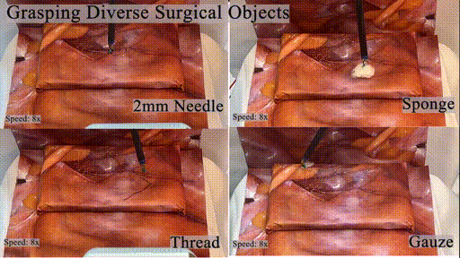
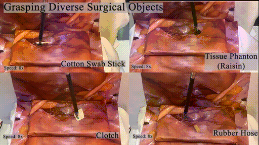

# 1. World Models for General Surgical Grasping

Official implementation of the "Grasp Anything for Surgery" (GAS).
[[project website](http://hongbinlin.com/gas/)] [[paper](https://arxiv.org/pdf/2405.17940)]

|  |  |
| :----------------------: | :-----------------------: |

# 2. Install

## 2.1. Download
```sh
git clone https://github.com/linhongbin/gas.git
cd gas
git submodule update --init --recursive
```

## 2.2. Conda Install

- Install [Anancoda](https://www.anaconda.com/download).

- Edit environment variables, go to [config.sh](./config/config_surrol.sh) and edit your environment variables.

- Create virtual environment in anaconda
    ```sh
    source config/config_surrol.sh 
    source $ANACONDA_PATH/bin/activate 
    conda create -n $ENV_NAME python=3.9 -y
    ```

- Install package 
    ```sh
    source bash/init_surrol.sh
    conda install cudnn=8.2 cudatoolkit=11.3 libffi==3.3 ffmpeg -c anaconda -c conda-forge -y
    pushd ext/SurRoL/ && python -m pip install -e . && popd # install surrol
    pushd ext/dreamerv2/ && python -m pip install -e . && popd # install dreamerv2
    python -m pip install -e . # install gym_ras
    ```
    > Our GPU Dependency in Anaconda: cudatoolkit=11.3, cudnn=8.2,tensorflow=2.9.0 tensorflow_probability=0.17.0. Other versions should work, while user need to check the compatability of cuda and tensorflow.  

# 3. Run

## 3.1. Play Environment

  - Play environment with keyboard control 
    ```sh
    source bash/init_surrol.sh
    python ./run/env_play.py --env-tag gas_surrol # without pybullet GUI
    python ./run/env_play.py --env-tag gas_surrol gui # or using pybullet GUI to better visualize
    ```

    keyboard mapping:
    
    `w` `s` `a` `d`: moving gripper forward, backward, left, and right

    `i` `k` `j` `l`: moving gripper upward, downward, rotating clockwise and counter-clockwise

    `n`: toggle the gripper jaw

    `q`: exit the program


  - Play with script demonstration 
    ```sh
    python ./run/env_play.py --env-tag gas_surrol --oracle script
    ```

  - Play with random action 
    ```sh
    python ./run/env_play.py --env-tag gas_surrol --action random
    ```
    
## 3.2. Train

- Train our method
    ```sh
    source bash/init_surrol.sh
    python ./run/rl_train.py --env-tag gas_surrol --baseline dreamerv2 --baseline-tag gas
    ```

- Train other baselines 
    ```sh
    python ./run/rl_train.py --env-tag gas_surrol raw --baseline dreamerv2 --baseline-tag gas # GAS-Raw
    python ./run/rl_train.py --env-tag gas_surrol no_depth_estimation --baseline dreamerv2 --baseline-tag gas # GAS-NoDE
    python ./run/rl_train.py --env-tag gas_surrol no_clutch --baseline dreamerv2 --baseline-tag gas # GAS-NoClutch
    python ./run/rl_train.py --env-tag gas_surrol no_dm --baseline dreamerv2 --baseline-tag gas # GAS-NoDR
    python ./run/rl_train.py --env-tag gas_surrol raw no_clutch --baseline dreamerv2 --baseline-tag gas # DreamerV2
    python ./run/rl_train.py --env-tag gas_surrol raw no_clutch --baseline ppo # PPO
    ```

- Mornitor training with tensorboard, open a new terminal
    ```sh
    source bash/init_surrol.sh
    tensorboard --logdir ./log/
    ```


## 3.3. Evaluation
### 3.3.1. Pretrained Models
  
User can direclty use our pretrained models for evaluation for simulation and real robot if you want to skip the training. These models can be downloaded by the links in the following table; we also list their corresponding sucess rates (SR) in simulation and real robots for our performance study in the paper:
|              |                                                                           Model                                                                            | Sim-SR | Real-SR |
| :----------: | :--------------------------------------------------------------------------------------------------------------------------------------------------------: | :----: | :-----: |
|  GAS (ours)  | [Download](https://mycuhk-my.sharepoint.com/:u:/g/personal/1155097177_link_cuhk_edu_hk/EXRee1wtjxNBtxEKjQDay7kB15cl58-LBgRTRlqjJp6Phg?e=v2rbF2&download=1) |  87%   |   75%   |
|   GAS-NoDR   | [Download](https://mycuhk-my.sharepoint.com/:u:/g/personal/1155097177_link_cuhk_edu_hk/EfRwARbAi1VIhrPn1ESWUnkB_9F5wU6SyDJ8xs-VEhSyLQ?e=O2cfF5&download=1) |  84%   |   58%   |
| GAS-NoClutch | [Download](https://mycuhk-my.sharepoint.com/:u:/g/personal/1155097177_link_cuhk_edu_hk/EZn1Ei7XTPFHj1J1muXZE5QBHMALIeUFs1A7BVkdUqWN7g?e=RAhbFx&download=1) |  36%   |   0%    |
|   GAS-Raw    | [Download](https://mycuhk-my.sharepoint.com/:u:/g/personal/1155097177_link_cuhk_edu_hk/EX_g_ph0I65JhUIje_wHLs4BW7G8ybm9K0rghlGSMzqjDQ?e=ZbKCZ0&download=1) |   0%   |   0%    |
|   GAS-NoDE   | [Download](https://mycuhk-my.sharepoint.com/:u:/g/personal/1155097177_link_cuhk_edu_hk/EXpRpGEgxYNPpUd2CDTHLwMBIoIXyEkrjnHYJGa8yQKypA?e=Eoqatc&download=1) |   0%   |   0%    |
|  DreamerV2   | [Download](https://mycuhk-my.sharepoint.com/:u:/g/personal/1155097177_link_cuhk_edu_hk/EbhCutr_fr1KiLrkq6BKwnAB4th_WnR3uq8qLR7xB2ycWQ?e=f7S2BM&download=1) |   0%   |   1%    |
|     PPO      | [Download](https://mycuhk-my.sharepoint.com/:u:/g/personal/1155097177_link_cuhk_edu_hk/EcvH8m0OpMFBmiSONJaxsdgB5Qv3jGd8YOGo0s41b6EwEQ?e=OFSv8m&download=1) |   0%   |   2%    |


### 3.3.2. Simulation

- Run evaluation of our method:
    ```sh
    source bash/init_surrol.sh
    python ./run/rl_train.py --reload-dir ./log/2024_01_21-13_57_13@ras-gas_surrol@dreamerv2-gas@seed1/ --reload-envtag gas_surrol --online-eval --visualize --vis-tag obs rgb mask --online-eps 20 --save-prefix GAS
    ```

    arguments:

    `reload-dir`: the path to your checkpoint directory

    `--reload-envtag` the environtment tag, which is required to sync that you use in training

    `--vis-tag` a list of cv2 show images, the list: [rgb, depth, mask, dsa]

    `--online-eps` episodes for evaluation

    `--save-prefix` prefix for save result file 


- Run other methods
    ```sh
    python ./run/rl_train.py --reload-dir ./data/agent/GAS-NoDR/2024_01_26-15_23_06@ras-gas_surrol-no_dr@dreamerv2-gas@seed1/ --reload-envtag gas_surrol no_dr --online-eval --visualize --vis-tag obs rgb mask --online-eps 20 --save-prefix GAS-NoDR # GAS-NoDR
    python ./run/rl_train.py --reload-dir ./data/agent/dreamerv2/2024_01_25-12_23_27@ras-gas_surrol-raw-no_clutch@dreamerv2-gas@seed1/ --reload-envtag gas_surrol raw no_clutch --online-eval --visualize --vis-tag obs rgb mask --online-eps 20 --save-prefix dreamerv2 # dreamerv2
    python ./run/rl_train.py --reload-dir ./data/agent/PPO/2024_01_26-23_55_16@ras-gas_surrol-raw-no_clutch@ppo@seed2/ --reload-envtag gas_surrol  raw no_clutch   --online-eval --visualize --vis-tag obs rgb mask --online-eps 20 --save-prefix PPO # PPO
    ```
### 3.3.3. Real Robot

Please refer to [eval_dvrk.md](./doc/eval_dvrk.md) for the evaluation in real robot.


# 4. Citation
```
 @article{lin2024world,
  title={World Models for General Surgical Grasping},
  author={Lin, Hongbin and Li, Bin and Wong, Chun Wai and Rojas, Juan and Chu, Xiangyu and Au, Kwok Wai Samuel},
  journal={Robotics: Science and Systems},
  year={2024}
}
```
# 5. Acknowledgement

This work integrates several amazing works: [dreamerv2](https://github.com/linhongbin-ws/dreamerv2.git), [stable-baselines3](https://github.com/linhongbin-ws/stable-baselines3), [Track-Anything](https://github.com/linhongbin-ws/Track-Anything.git), [SurRoL](https://github.com/linhongbin-ws/SurRoL.git), [dVRK](https://github.com/jhu-dvrk/sawIntuitiveResearchKit), [ds4drv](https://github.com/naoki-mizuno/ds4drv). Thanks for their efforts.
For any issue or question, welcome to open an issue in the github.